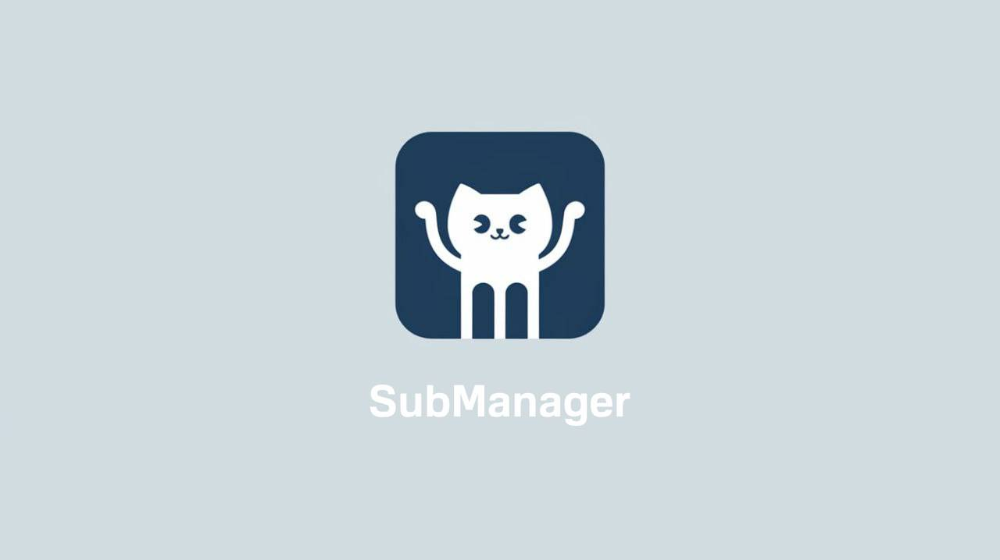

<div align="center">
	
    <h1>SubManager v2.0</h1>
    <h2>Enhanced with Async/Await for Lightning-Fast Performance ⚡</h2>
      <a href="https://github.com/DIMFLIX/SubManager/issues">
		
	</a>
	<a href="https://github.com/DIMFLIX/SubManager/stargazers">
		
	</a>
	<a href="./LICENSE">
		
	</a>
</div>

<h2 align="center">Project Description</h2>

**SubManager** is a powerful Python tool designed to automate the management of your GitHub subscriptions. It intelligently synchronizes your followers and following lists, helping you grow your network and maintain a relevant feed.

This rewritten version (v2.0) is fully asynchronous, using `aiohttp` and GitHub's official API for maximum speed and efficiency. It's faster, more reliable, and less prone to rate limiting.

### Key Features:

- **🚀 Fully Asynchronous:** Operations are performed concurrently for a significant speed boost.
- **⚙️ Official API Usage:** Uses the GitHub API instead of HTML parsing for reliability and performance.
- **🔧 Flexible YAML Configuration:** A single `.env.yaml` file to manage all settings, including authentication, promotion logic, and ban lists.
- **🤖 Smart Promotion:** Discovers new users to follow based on the networks of your existing followers, helping you expand your reach.
- **🛡️ Advanced Ban Lists:** Fine-grained control over who to follow, unfollow, or ignore completely.
- **🔔 Cron & Desktop Notifications:** Includes easy-to-use scripts to set up automated execution with `cron` and receive desktop notifications summarizing the results.

---

<h2 align="center">Installation</h2>

1.  **Clone the repository:**
    ```bash
    git clone https://github.com/DIMFLIX/SubManager.git
    cd SubManager
    ```

2.  **Install dependencies:**
    ```bash
    pip install -r requirements.txt
    ```

3.  **Create your configuration file:**
    Copy the example configuration file to create your own.
    ```bash
    cp .env.yaml.example .env.yaml
    ```

4.  **Edit your configuration:**
    Open `.env.yaml` with your favorite text editor and fill in your details, especially your GitHub `username` and `token`.

    > **Important:** To generate a personal access token, follow the official GitHub documentation. Make sure to grant the `read:user` and `write:user` scopes.

---

<h2 align="center">Configuration (.env.yaml)</h2>

All settings are managed in the `.env.yaml` file. Here’s a breakdown:

```yaml
# GitHub Authentication
github:
  username: "YOUR_GITHUB_USERNAME"
  token: "ghp_YOUR_GITHUB_PERSONAL_ACCESS_TOKEN"

# Promotion Settings
promotion:
  enabled: true
  days_period: 3      # Days to keep a promoted user before they can be unfollowed
  count_users: 500    # Target number of promoted users to maintain

# Advanced Settings
settings:
  retry_on_error: true
  max_concurrent_requests: 5 # Concurrent API requests
  request_delay: 0.5       # Delay between batches of requests
  batch_size: 5            # Users to process in each batch

# Ban Lists (Exclusion Rules)
ban_lists:
  # Users you will NEVER unfollow, even if they don't follow you back.
  # Ideal for important contacts, organizations, or projects.
  never_unfollow:
    - "octocat"
    - "torvalds"
  
  # Users you will NEVER follow, even if they follow you.
  # Useful for ignoring specific accounts (e.g., bots).
  never_follow:
    - "spammer123"
  
  # Users to be completely ignored. They won't be followed, and they won't
  # be counted as followers for the purpose of following back.
  ignore_completely: []

# Logging
logging:
  level: "INFO"  # DEBUG, INFO, WARNING, ERROR, CRITICAL
  file: "subscription_manager.log"
```

---

<h2 align="center">Usage</h2>

#### Run Subscription Management

To run the full follow/unfollow process:

```bash
python3 main.py
```

#### Show Statistics

To view your current follower/following statistics without performing any actions:

```bash
python3 main.py --stats
```

---

<h2 align="center">Automation with Cron and Notifications</h2>

Easily automate the script to run on a schedule with desktop notifications on Linux.

#### Requirements

For desktop notifications, you need `libnotify`.

```bash
# For Arch / EndeavourOS
sudo pacman -S libnotify

# For Debian / Ubuntu
sudo apt-get install libnotify-bin
```

### Interactive Setup

An interactive script is included to make setup a breeze.

```bash
./setup_cron.sh
```

This wizard will guide you through:

1.  **Choosing an execution schedule** (e.g., every 2 hours, once a day).
2.  **Enabling or disabling desktop notifications.**

It will then automatically create a `cron` job for you.

<div align="center">
	
</div>

### Removal

To remove the cron job, simply run the removal script:

```bash
./remove_cron.sh
```

This script will ask for confirmation before deleting the cron job and associated log files.

### Manual Testing

- **Test the wrapper script (which cron runs):**
  ```bash
  ./cron_wrapper.sh
  ```
- **Test notifications and statistics parsing:**
  ```bash
  ./test_notifications.sh
  ```

---

<h2 align="center">License</h2>

This project is licensed under the MIT License. See the [LICENSE](./LICENSE) file for details.

<h2 align="center">Contacts</h2>

If you have any questions, suggestions or would like to discuss the project, please contact me via Telegram: <a href="https://t.me/dimflix_official">@dimflix_official</a>.
